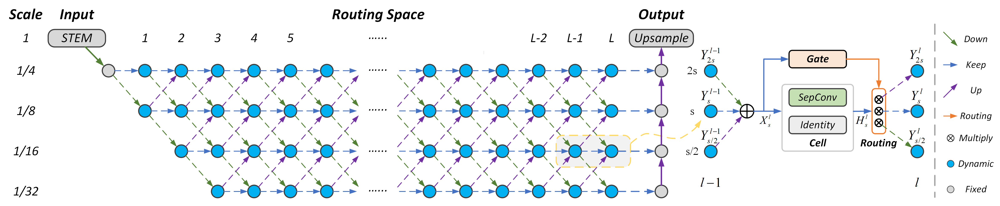

# DynamicRouting

This project provides an implementation for "[Learning Dynamic Routing for Semantic Segmentation](https://arxiv.org/abs/2003.10401)" (*CVPR2020 Oral*) on PyTorch.
For the reason that experiments in the paper were conducted using internal framework, this project reimplements them on *dl_lib* and reports detailed comparisons below. Some parts of code in *dl_lib* are based on [detectron2](https://github.com/facebookresearch/detectron2).



## Requirement
- Python >= 3.6
    - `python3 --version`
- PyTorch >= 1.3
    - `pip3 install torch torchvision`
- OpenCV
    - `pip3 install opencv-python`
- GCC >= 4.9
    - `gcc --version`

## Installation

Make sure that your get at least one gpu when compiling. Run:
- `git clone https://github.com/yanwei-li/DynamicRouting.git`
- `cd DynamicRouting`
- `sudo python3 setup.py build develop`

## Usage

### Dataset
We use Cityscapes dataset for training and validation. Please refer to [`datasets/README.md`](datasets/README.md) or dataset structure in [detectron2](https://github.com/facebookresearch/detectron2) for more details.
- Cityscapes [Download](https://www.cityscapes-dataset.com/)

### Pretrained Model
We give ImageNet pretained models:
- Layer16-Fix [GoogleDrive](https://drive.google.com/file/d/1WqVOZo8oelXTKlf0BDE3q2W-lyYm2G2U/view?usp=sharing)
- Layer33-Fix [GoogleDrive](https://drive.google.com/file/d/1xktVvVsYSaDlb8yQcn0zAzx2ZMUhyD_K/view?usp=sharing)

### Training
For example, if you want to train Dynamic Network with Layer16 backbone:
- Train from scratch
    ```shell
    cd playground/Dynamic/Seg.Layer16
    dl_train --num-gpus 4
    ```
- Use ImageNet pretrain
    ```shell
    cd playground/Dynamic/Seg.Layer16.ImageNet
    dl_train --num-gpus 4 MODEL.WEIGHTS /path/to/your/save_dir/ckpt.pth
    ```

NOTE: Please set `FIX_SIZE_FOR_FLOPS` to `[768,768]` and `[1024,2048]` for training and evaluation, respectively.

### Evaluation
You can evaluate the trained or downloaded model:
- Evaluate the trained model
    ```shell
    dl_test --num-gpus 8
    ```
- Evaluate the downloaded model:
    ```shell
    dl_test --num-gpus 8 MODEL.WEIGHTS /path/to/your/save_dir/ckpt.pth 
    ```

NOTE: If your machine does not support such setting, please change settings in `config.py` to a suitable value. 

## Performance
### Cityscapes *val* set
***Without* ImageNet Pretrain:**

 Methods | Backbone | Iter/K | mIoU (paper) | GFLOPs (paper) | mIoU (ours) | GFLOPs (ours) | Model 
:--:|:--:|:--:|:--:|:--:|:--:|:--:|:--:
Dynamic-A | Layer16 | 186 | 72.8 | 44.9 | 73.9 | 52.5 | [GoogleDrive](https://drive.google.com/file/d/1Fa4hLS2GKL90HR0tVhmcZkFwemK6DlgT/view?usp=sharing)
Dynamic-B | Layer16 | 186 | 73.8 | 58.7 | 74.3 | 58.9 | [GoogleDrive](https://drive.google.com/open?id=1o31jNkoSMugK0rEsi6grE9WEioWJgsZN)
Dynamic-C | Layer16 | 186 | 74.6 | 66.6 | 74.8 | 59.8 | [GoogleDrive](https://drive.google.com/open?id=1nJ8oJD9yZj82hTlyDcMBGd9kmpIZVIto)
Dynamic-Raw | Layer16 | 186 | 76.1 | 119.5 | 76.7 | 114.9 | [GoogleDrive](https://drive.google.com/open?id=1_fSMzzaUVzbkjYqSuvD2EmmZiZZVsDvh)
Dynamic-Raw | Layer16 | 558 | 78.3 | 113.3 | 78.1 | 114.2 | [GoogleDrive](https://drive.google.com/open?id=1ToV_YAVxv5pCoRTreIXsQxNI5jolektt)

***With* ImageNet Pretrain:**

 Methods | Backbone | Iter/K | mIoU (paper) | GFLOPs (paper) | mIoU (ours) | GFLOPs (ours) | Model 
:--:|:--:|:--:|:--:|:--:|:--:|:--:|:--:
Dynamic-Raw | Layer16 | 186 | 78.6 | 119.4 | 78.8 | 117.8 | [GoogleDrive](https://drive.google.com/open?id=1xRZkRw5qIKc_A6repZkRmLUpSAnnU63e)
Dynamic-Raw | Layer33 | 186 | 79.2 | 242.3 | 79.4 | 243.1 | [GoogleDrive](https://drive.google.com/file/d/1DdLwt0jzBTqx_3EFGPLm_gWdaeoXXux7/view?usp=sharing)

## To do
- [ ] Faster inference speed
- [ ] Support more vision tasks
    - [ ] Object detection
    - [ ] Instance segmentation
    - [ ] Panoptic segmentation

## Acknowledgement
- [Detectron2](https://github.com/facebookresearch/detectron2)
- [DARTS](https://github.com/quark0/darts)

## Citation
Consider cite the Dynamic Routing in your publications if it helps your research. 

```
@inproceedings{li2020learning,
    title = {Learning Dynamic Routing for Semantic Segmentation},
    author = {Yanwei Li, Lin Song, Yukang Chen, Zeming Li, Xiangyu Zhang, Xingang Wang, Jian Sun},
    booktitle = {IEEE Conference on Computer Vision and Pattern Recognition},
    year = {2020}
}
```

Consider cite this project in your publications if it helps your research. 
```
@misc{DynamicRouting,
    author = {Yanwei Li},
    title = {DynamicRouting},
    howpublished = {\url{https://github.com/yanwei-li/DynamicRouting}},
    year ={2020}
}
```